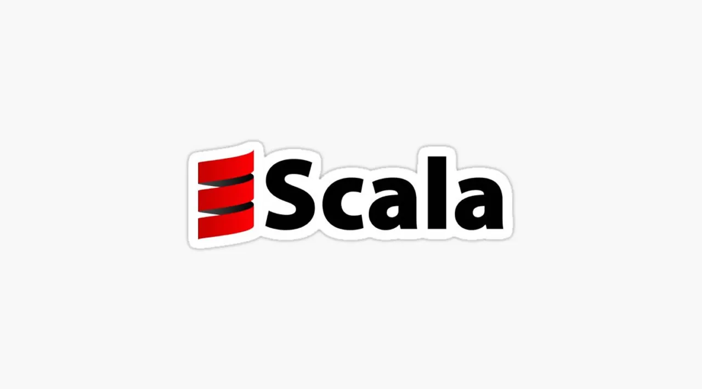

## Portfolio

I am an electrical undergraduate, currently interning at IQVIA as software developer intern.I have hands on experience working with programming langauges and data structure & algorithms.I have extensively worked on big data technologies like hadoop ,spark and scala for 5 months.

---
## Education

### **BIRSA INSTITUTE OF TECHNOLOGY,SINDRI**
### BTech Electrical Engineering (2018- 2022)
CGPA 8.69

---
## Skills

  
  
  
   
   

---

## Experience

### **SOFTWARE DEVELOPER INTERN**
### IQVIA

Working with the production operation team to deal with job failures incident & re-triggering the respective failed spark job of the developers team by reviewing the script files and log files.Collaborating and helping the developers team for the deployment of code into production environment during the deployment phase.Getting exposure & learning big data technologies like hadoop, spark, scala ,hive & impala  to solve big data related problems.

---

## Projects

### **Flutter app**

kkdkddkdkkfkf
### **Face mask**

kdkdkdk

---
## Kaggle competitions 

### **Cassava**
hdjdkdkkd
### **Ranzcr**
---
### INTERESTS

I enjoy being outdoors,so i go for run everyday.I love travelling to different destinations and explore different cultures. 
