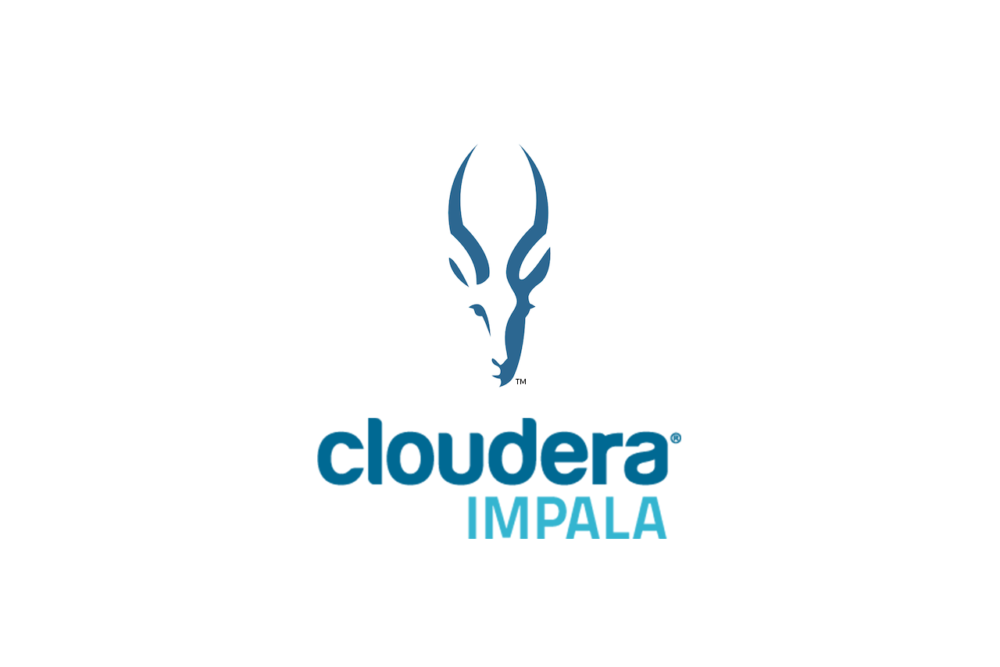

## Portfolio

I am an electrical undergraduate, currently interning at IQVIA as software developer intern.I have hands on experience working with programming langauges and data structure & algorithms.I have extensively worked on big data technologies like hadoop ,spark and scala for 5 months.

---
## Education

### **BIRSA INSTITUTE OF TECHNOLOGY,SINDRI**
### BTech Electrical Engineering (2018- 2022)
CGPA 8.69

---
### **Computer Languages:**
C and C++ , Python (numpy , pandas, matplotlib, seaborn) , SQL

### **Computer Science Skills:**
Data Structures & Algorithms , RDBMS, Object-Oriented Programming, Linux shell-scripting, Machine Learning.

---
## Frameworks

   
   
   
   
   
   
   
  

---

## Experience

### **SOFTWARE DEVELOPER INTERN**
### IQVIA

Working with the production operation team to deal with job failures incident & re-triggering the respective failed spark job of the developers team by reviewing the script files and log files. Collaborating and helping the developers team for the deployment of code into production environment during the deployment phase. Getting exposure & learning big data technologies like hadoop, spark, scala ,hive & impala  to solve big data related problems.

---

## Projects

### **Face Mask Detection (python, computer vision, opencv, darknet):**

• A simple machine learning model for face mask detection which can be used to detect the presence or absence of face mask. 
• Used yolov3 darknet framework for implementing the machine learning model and applied transfer learning technique. 
• Used opencv for image processing and model inference purpose.

### **Flutter App Development (python, computer-vision, tflite, dart):**
• Successfully built a Flutter App to identify 20 different plant leafs with some pictures using realtime database with smartphone camera. 
• Used yolov3 tensorflow api for implementing the machine learning model and applied transfer learning technique for finetuning of the model. 
• Converted tensorflow model to tensorflowlite model and integrated in the flutter application.

---
### **GFG & Leetcode Profile**

[GFG Profile](https://auth.geeksforgeeks.org/user/electrical18/practice) 

[Leetcode Profile](https://leetcode.com/sanskar_981/)

---
## Kaggle competitions 

### **Cassava Leaf Diseases Classification Problem:**
Participated in cassava leaf diseases classification problem organised at kaggle platform and secured 2163th rank in the leadarboard. 
[Cassava Leaf Diseases Classification Problem Link](https://www.kaggle.com/c/cassava-leaf-disease-classification)
### **Ranzcr Catheter Positioning Problem:**
Participated in ranzcr catheter positioning problem organised at kaggle platform and secured 1124th rank in the leadarboard. 
[Ranzcr Catheter Positioning Problem Link](https://www.kaggle.com/c/ranzcr-clip-catheter-line-classification)

---
### INTERESTS

I enjoy being outdoors,so i go for run everyday.I love travelling to different destinations and explore different cultures. 
